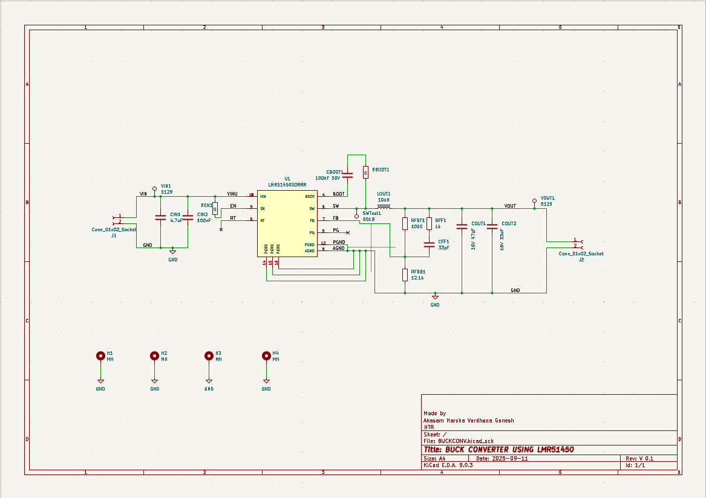
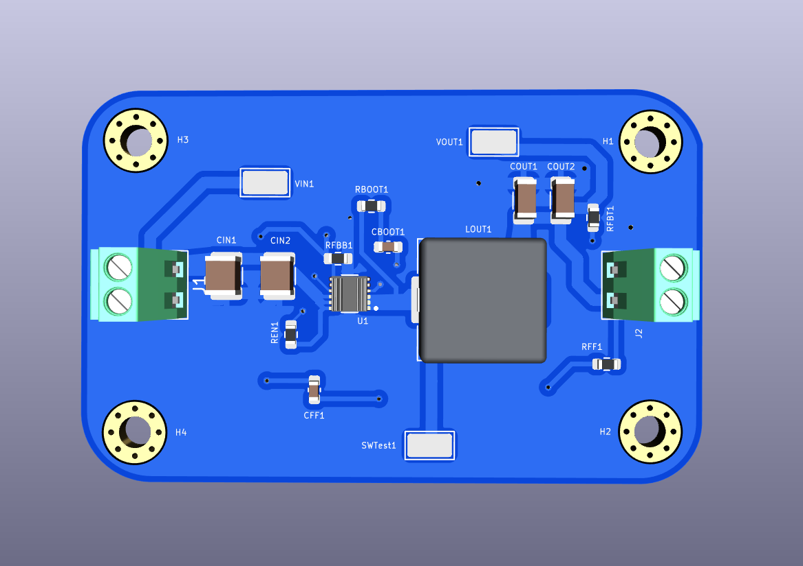

# LMR51450 Buck Converter

## Overview
This repository contains the KiCad hardware design files for a synchronous step-down (buck) converter based on the Texas Instruments **LMR51450**. The board is designed to efficiently convert a higher DC input voltage to a lower, regulated DC output voltage, making it ideal for various embedded power supply applications.

## Schematic & Architecture
The core of the design is the LMR51450 regulator. The output voltage is configured via the precision feedback resistor network (**RFBT1**: 100kΩ, **RFBB1**: 12.1kΩ), with a feedforward capacitor (**CFF1**: 33pF) included to improve transient response.

## PCB Renders and Layout

### 3D Render (Front)

### PCB Layout

### Top Layer

### Bottom Layer

## Hardware Details
* **Regulator IC:** Texas Instruments LMR51450 (Synchronous Buck)
* **Inductor:** 10µH (LOUT1)
* **Input Stage:** 2-pin socket (J1) with 4.7µF (CIN1) + 100nF (CIN2) decoupling capacitors for noise filtering.
* **Output Stage:** 47µF (COUT1) + 33µF (COUT2) at 16V rating for voltage ripple smoothing.
* **Test Points:** Dedicated test points for `VIN`, `VOUT`, and the `SW` (Switching) node for easy oscilloscope probing and debugging.
* **Mounting:** 4x grounded mounting holes (H1-H4).

## Getting Started
1. Clone the repository to your local machine.
2. Open the project in KiCad to view or modify the schematic (`.kicad_sch`) and PCB layout (`.kicad_pcb`).
3. The `Media/` folder contains exported renders and layout references for quick viewing.

## License
[Insert License Here - e.g., MIT, CERN-OHL-W]
